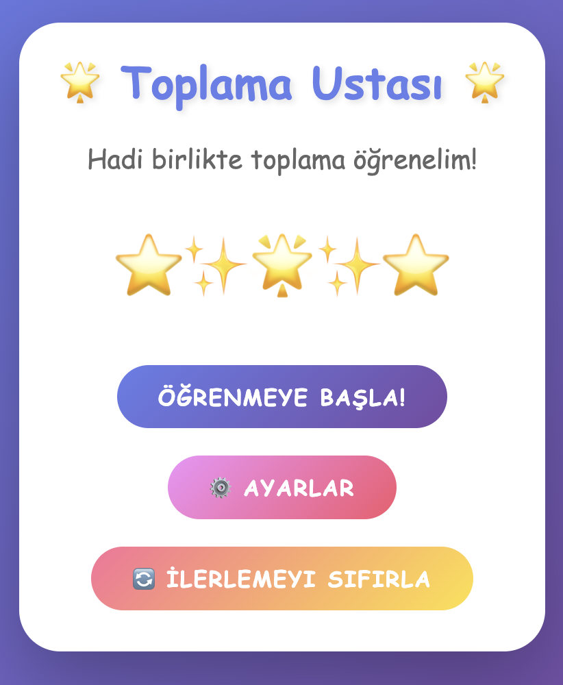
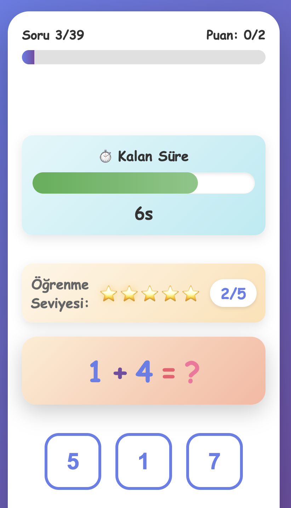
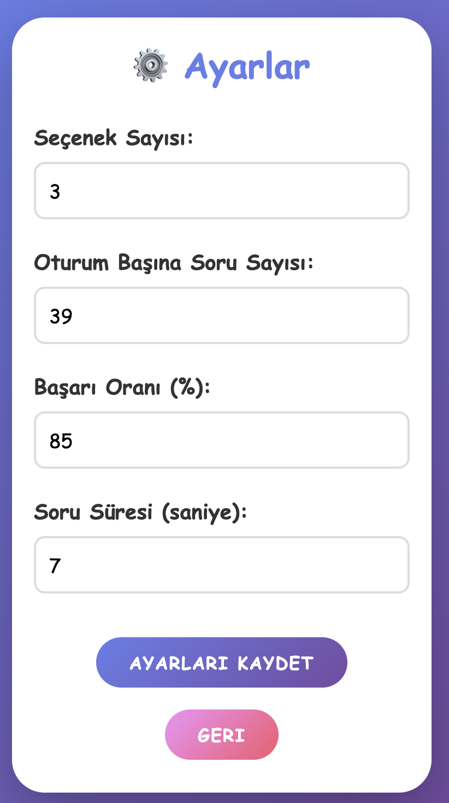
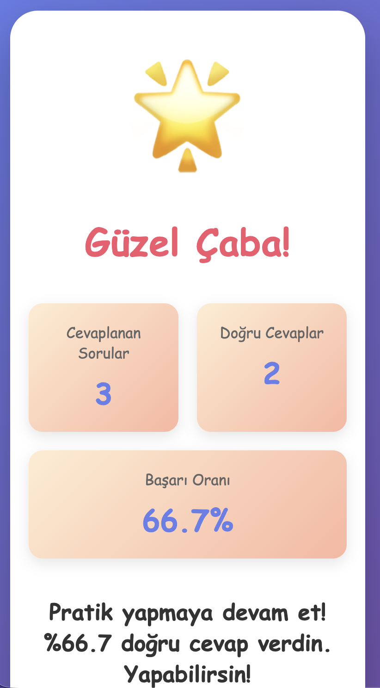

# 🌟 Toplama Ustası - Addition Master

Tek haneli toplama işlemlerini öğrenmek için tasarlanmış eğlenceli ve etkileşimli bir web uygulaması. Öncelik kuyruğu algoritması kullanarak öğrenmeyi pekiştirir.

A fun and interactive web application designed to teach single-digit addition using a priority queue algorithm for reinforced learning.

## ✨ Özellikler / Features

### 🎯 Akıllı Öğrenme Sistemi / Smart Learning System
- **Öncelik Kuyruğu Algoritması**: Her soru bir öğrenme seviyesine sahiptir (1-5)
- **Priority Queue Algorithm**: Each question has a learning level (1-5)
- Doğru cevaplar seviyeyi artırır, yanlış cevaplar azaltır
- Correct answers increase the level, incorrect answers decrease it
- Düşük seviyeli sorular öncelikli olarak gösterilir
- Questions with lower levels are prioritized

### 🔄 Değişme Özelliği / Commutative Property
- 3+4 ve 4+3 aynı soru olarak kabul edilir
- 3+4 and 4+3 are treated as the same question
- Aynı öğrenme seviyesini paylaşırlar
- They share the same learning level

### 🎲 Soru Çeşitliliği / Question Variety
- Aynı soru arasında minimum 5 soru boşluğu garantisi
- Guaranteed minimum gap of 5 questions between same question
- Aynı seviyedeki sorular rastgele sırayla gösterilir
- Questions at the same level are shown in random order

### ⏱️ Zaman Yönetimi / Time Management
- Her soru için yapılandırılabilir süre (varsayılan 7 saniye)
- Configurable timeout per question (default 7 seconds)
- Görsel geri sayım çubuğu
- Visual countdown progress bar
- Renk kodlu uyarılar (yeşil → turuncu → kırmızı)
- Color-coded warnings (green → orange → red)

### ⭐ Öğrenme Seviyesi Göstergesi / Learning Level Display
- Her soru için görsel yıldız sistemi (5 yıldız)
- Visual star system for each question (5 stars)
- Sayısal seviye göstergesi (X/5)
- Numeric level indicator (X/5)

### 🎨 Motivasyon Özellikleri / Motivational Features
- Doğru cevaplar için kutlama mesajları
- Celebration messages for correct answers
- Yanlış cevaplar için cesaret verici mesajlar
- Encouraging messages for incorrect answers
- Renkli ve canlı arayüz
- Colorful and vibrant interface
- Animasyonlu geri bildirimler
- Animated feedback

### ⚙️ Yapılandırma / Configuration
Tüm ayarlar özelleştirilebilir:
- Seçenek sayısı (2-6, varsayılan: 3)
- Oturum başına soru sayısı (10-100, varsayılan: 39)
- Başarı oranı hedefi (50-100%, varsayılan: 80%)
- Soru süresi (3-30 saniye, varsayılan: 7)

All settings are customizable:
- Number of choices (2-6, default: 3)
- Questions per session (10-100, default: 39)
- Success rate target (50-100%, default: 80%)
- Question timeout (3-30 seconds, default: 7)

### 💾 İlerleme Takibi / Progress Tracking
- LocalStorage kullanarak ilerleme kaydedilir
- Progress saved using LocalStorage
- Her soru için bireysel öğrenme seviyesi
- Individual learning level for each question
- İstendiğinde ilerleme sıfırlanabilir
- Progress can be reset on demand

### ⌨️ Klavye Kısayolları / Keyboard Shortcuts
- **ESC**: Oturumdan çık / Quit session

## 📸 Ekran Görüntüleri / Screenshots

### Ana Ekran / Welcome Screen

*Uygulamaya hoş geldiniz ekranı / Application welcome screen*

### Oyun Ekranı / Game Screen

*Soru ekranı: öğrenme seviyesi, geri sayım ve cevap seçenekleri / Question screen with learning level, countdown, and answer choices*

### Ayarlar / Settings

*Tüm parametrelerin özelleştirilebileceği ayarlar ekranı / Settings screen where all parameters can be customized*

### Sonuç Ekranı / Results Screen

*Oturum sonuçları ve istatistikler / Session results and statistics*

## 🚀 Kullanım / Usage

### Kurulum / Installation
```bash
# Repository'yi klonlayın / Clone the repository
git clone https://github.com/yourusername/addition-master.git

# Klasöre gidin / Navigate to folder
cd addition-master

# index.html dosyasını bir web tarayıcısında açın
# Open index.html in a web browser
open index.html
```

### Kullanıcı Kılavuzu / User Guide

1. **Başlangıç / Start**
   - "Öğrenmeye Başla!" butonuna tıklayın
   - Click "Start Learning!" button

2. **Soru Çözme / Answering Questions**
   - Ekranda gösterilen toplama sorusunu okuyun
   - Read the addition question displayed
   - Doğru cevabı seçeneklerden seçin
   - Select the correct answer from choices
   - Geri sayım sıfıra inmeden cevap verin
   - Answer before countdown reaches zero

3. **Ayarları Değiştirme / Changing Settings**
   - Ana ekranda "⚙️ Ayarlar" butonuna tıklayın
   - Click "⚙️ Settings" button on main screen
   - İstediğiniz parametreleri değiştirin
   - Modify desired parameters
   - "Ayarları Kaydet" ile kaydedin
   - Save with "Save Settings"

4. **İlerlemeyi Sıfırlama / Resetting Progress**
   - Ana ekranda "🔄 İlerlemeyi Sıfırla" butonuna tıklayın
   - Click "🔄 Reset Progress" button on main screen
   - Tüm soruların seviyesi 1'e döner
   - All questions return to level 1

## 🏗️ Teknik Detaylar / Technical Details

### Teknolojiler / Technologies
- **HTML5**: Yapı / Structure
- **CSS3**: Stil ve animasyonlar / Styling and animations
- **JavaScript (ES6+)**: Uygulama mantığı / Application logic
- **LocalStorage API**: Veri kalıcılığı / Data persistence

### Algoritma / Algorithm

#### Öncelik Kuyruğu / Priority Queue
```javascript
// Düşük seviye = Yüksek öncelik
// Low level = High priority
Level 1 → En sık gösterilir / Shown most frequently
Level 5 → En az gösterilir / Shown least frequently
```

#### Öğrenme Mekanizması / Learning Mechanism
```
Doğru Cevap / Correct Answer:
  Seviye = min(seviye + 1, 5)
  Level = min(level + 1, 5)

Yanlış Cevap veya Zaman Aşımı / Incorrect Answer or Timeout:
  Seviye = max(seviye - 1, 1)
  Level = max(level - 1, 1)
```

#### Soru Seçim Stratejisi / Question Selection Strategy
1. En düşük seviyedeki soruları bul / Find questions at lowest level
2. Son 5 soruda gösterilenleri filtrele / Filter out questions shown in last 5
3. Kalan sorulardan rastgele seç / Randomly select from remaining
4. Eğer hepsi son 5'te, bir üst seviyeye geç / If all recent, move to next level
5. Tüm kuyruktaki sorular son 5'te ise, herhangi birini seç / If entire queue recent, pick any

### Dosya Yapısı / File Structure
```
addition_app/
├── index.html          # Ana HTML dosyası / Main HTML file
├── style.css           # Stil dosyası / Stylesheet
├── app.js              # Uygulama mantığı / Application logic
├── README.md           # Bu dosya / This file
└── screenshots/        # Ekran görüntüleri / Screenshots
    ├── welcome.png
    ├── game.png
    ├── settings.png
    └── results.png
```

## 🎓 Eğitim Felsefesi / Educational Philosophy

Bu uygulama **aralıklı tekrar** (spaced repetition) prensibine dayanır:
- Zorlanılan sorular daha sık tekrar edilir
- Öğrenilen sorular daha az sıklıkta gelir
- Her çocuk kendi hızında ilerler

This application is based on **spaced repetition**:
- Difficult questions are repeated more frequently
- Mastered questions appear less often
- Each child progresses at their own pace

## 🤝 Katkıda Bulunma / Contributing

Katkılarınızı bekliyoruz! Lütfen:
1. Bu repository'yi fork edin
2. Yeni bir branch oluşturun (`git checkout -b feature/amazing-feature`)
3. Değişikliklerinizi commit edin (`git commit -m 'Add amazing feature'`)
4. Branch'inizi push edin (`git push origin feature/amazing-feature`)
5. Pull Request açın

Contributions are welcome! Please:
1. Fork this repository
2. Create a new branch (`git checkout -b feature/amazing-feature`)
3. Commit your changes (`git commit -m 'Add amazing feature'`)
4. Push to the branch (`git push origin feature/amazing-feature`)
5. Open a Pull Request

## 📝 Lisans / License

Bu proje MIT lisansı altında lisanslanmıştır.

This project is licensed under the MIT License.

## 👨‍💻 Geliştirici / Developer

Çocuğunuzun matematik yolculuğu için keyifli öğrenmeler! 🌟

Happy learning on your child's mathematics journey! 🌟

## 🐛 Bilinen Sorunlar / Known Issues

Şu anda bilinen bir sorun bulunmamaktadır. Bir sorun bulursanız lütfen issue açın.

No known issues at this time. Please open an issue if you find one.

## 🔮 Gelecek Özellikler / Future Features

- [ ] Çıkarma, çarpma ve bölme desteği / Support for subtraction, multiplication, division
- [ ] Ses efektleri / Sound effects
- [ ] Çoklu kullanıcı profilleri / Multiple user profiles
- [ ] İlerleme grafikleri / Progress charts
- [ ] Başarı rozetleri / Achievement badges
- [ ] Çevrimiçi skor tablosu / Online leaderboard
- [ ] Mobil uygulama versiyonu / Mobile app version

## 📞 İletişim / Contact

Sorularınız veya önerileriniz için lütfen issue açın.

For questions or suggestions, please open an issue.

---

**⭐ Bu projeyi beğendiyseniz yıldız vermeyi unutmayın! / If you like this project, don't forget to give it a star!**
